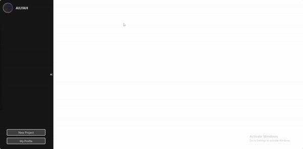

## AILIYAH - Image generation website 

This is the frontend repository of AILIYAH, an image generation platform done as part of the MCI project. The frontend repository was built using `React`, `React-Router/Remix`, styled with `TailwindCSS` and `radix-ui` through our [component](https://github.com/haryle/ailiyah-ui) library `@ailiyah-ui`. 

## Demo



## Install Instructions

Pull this repository. 

To install dependencies:
```
npm install 
```

## Setup Instruction

Make sure to follow the setup instructions in the [backend](https://github.com/haryle/ailiyah-backend) repository first. Once completed, run

```
npm run dev
```

You should then be able to interact with the UI. 